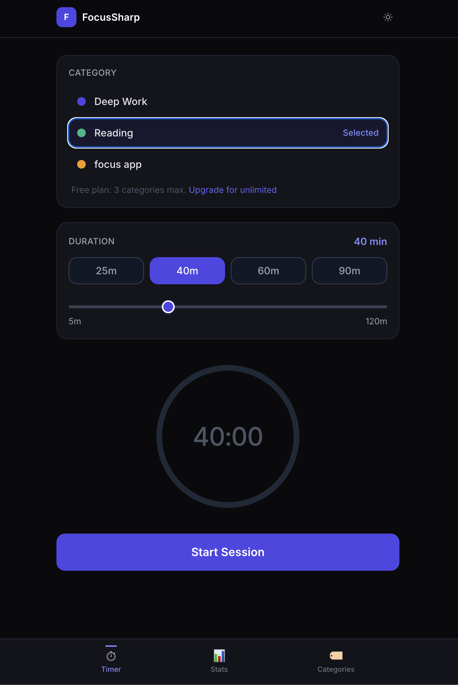
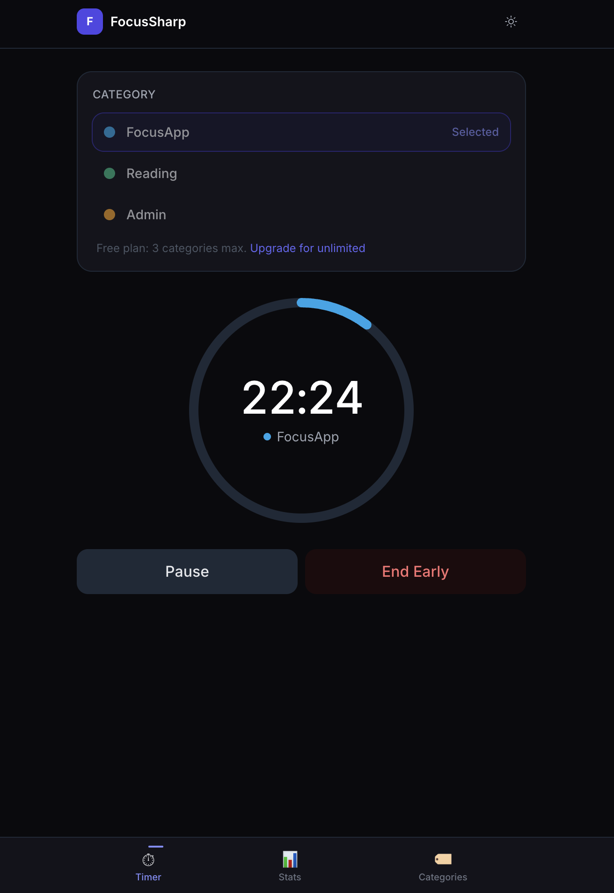
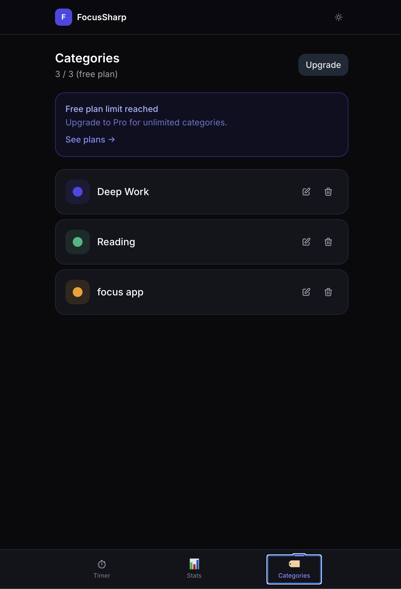

# FocusSharp ⏱️

> Focus time, your way.

FocusSharp is a minimal yet powerful focus timer and time tracking web app — built for people who want to know where their time actually goes, without the complexity of traditional Pomodoro apps.

No rigid 25/5 splits. No task management. No gamification. Just clean, honest focus tracking by category.

🌐 **Live:** [focussharp.app](https://focussharp.app)

---

## Screenshots

<p align="center">
  
  
  
</p>

---

## Why FocusSharp?

### The problem
Most focus apps fall into one of two traps:

1. **Too rigid** — Pomodoro apps lock you into 25/5 splits. Real work doesn't fit that. Deep work sessions often need 60–90 min. A reading session may need no fixed end at all.
2. **Too complex** — Apps like Toggl and Clockify are built for teams and billing. They're overkill for personal focus tracking and full of friction.

### How FocusSharp is different

| | FocusSharp | Pomodoro apps | Time trackers |
|---|---|---|---|
| Flexible duration | ✅ Any length | ❌ Fixed 25 min | ✅ |
| Flow / no-target mode | ✅ | ❌ | ✅ |
| Category tracking | ✅ Simple | ❌ | ✅ Complex |
| No account needed | ✅ | Varies | ❌ |
| Apple-native feel | ✅ | ❌ | ❌ |
| Break flow built in | ✅ | ✅ | ❌ |
| Stats by category | ✅ | ❌ | ✅ |

### Who it's for
- Students who study in long blocks and want to know how many hours went to which subject
- Deep workers (developers, writers, designers) who don't fit the Pomodoro mold
- Anyone who wants honest data on where their time goes — without signing up for a SaaS tool

---

## Features

### Timer
- ⏱️ **Timed sessions** — quick chips (25/40/60/90 min) + slider for any duration up to 120 min
- ∞ **Flow session** — count-up mode with no target time; focus until you're done
- 🔵 **Category-aware ring** — circular progress ring lights up in your category's color once you select one
- ⏸️ **Pause & resume** — mid-session pause with elapsed time preserved
- 🛑 **Smart end session** — sessions under 1 minute are not logged (accidental starts filtered out); over 1 min ends and logs immediately
- 🔄 **Category resets after each session** — forces deliberate re-selection for the next session

### Break flow
- ☕ **Timed breaks** — 5, 10, or 15 min countdown after every session
- 🌊 **Open break** — no timer, come back whenever you're ready
- ⏭️ **Skip break** — jump straight into the next session

### Categories
- 🏷️ **Custom categories** — create, name, and color-code up to 3 on the free plan
- 🎨 **Color picker** — 8 preset colors

### Stats
- 📊 **Stats dashboard** — today / 7-day / 30-day views, defaults to Today
- 🍩 **Donut chart** — time breakdown by category
- 📅 **Daily bar chart** — focus time per day
- 📈 **Period comparison** — % change vs previous period

### General
- 🌙 **Dark mode** — full support, no flash on load
- 📱 **Mobile first** — designed to feel like a native app on iOS Safari
- 🔒 **No account required** — works fully offline, all data stored locally
- ☁️ **Optional sync** — sign in to sync categories and sessions across devices (Supabase)

---

## Tech Stack

- [Next.js 14](https://nextjs.org/) — App Router
- [TypeScript](https://www.typescriptlang.org/)
- [Tailwind CSS](https://tailwindcss.com/)
- [Recharts](https://recharts.org/) — charts and analytics
- [Zustand](https://zustand-demo.pmnd.rs/) — state management
- [Framer Motion](https://www.framer.com/motion/) — animations
- [Vercel](https://vercel.com/) — deployment

---

## Getting Started

```bash
# Clone the repo
git clone https://github.com/yourusername/focussharp.git
cd focussharp

# Install dependencies
npm install

# Run locally
npm run dev
```

Open [http://localhost:3000](http://localhost:3000)

---

## Roadmap

- [x] Web app (Next.js)
- [ ] iOS app (SwiftUI)
- [ ] Apple Watch app (watchOS)
- [ ] Mac menu bar app (macOS)
- [ ] CloudKit sync across devices
- [ ] StoreKit 2 subscriptions

---

## Pricing

| Plan     | Price                       |
| -------- | --------------------------- |
| Free     | 3 categories, 7-day history |
| Monthly  | $3.99/mo                    |
| Annual   | $29.99/yr                   |
| Lifetime | $79 one-time                |

3-day free trial on all paid plans.

---

## Contributing

This is a solo indie project but issues and suggestions are welcome. Open an issue if you find a bug or have a feature idea that fits the minimal philosophy.

---

## License

MIT

---

<p align="center">
  Designed & developed by <a href="https://staarsolutions.ca">Sandeep Amarnath</a>
</p>
